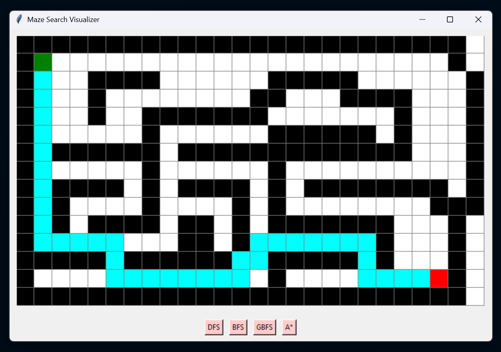

# Maze Search

A Python-based visual pathfinding tool that demonstrates how different search algorithms (DFS, BFS, Greedy Best‑First Search, and A*) explore a maze and construct a path from a start point **A** to a goal point **B**.

> **This project is inspired by Harvard's CS50AI course**, especially the maze search problem.  
> The logic, architecture separation (maze/logic/search/gui), and frontier implementations follow the same conceptual foundations while adding a fully visual Tkinter interface.

---

## 🖼️ Application Preview

Below is a placeholder image demonstrating how the Tkinter window looks when visualizing a path:



---

## 📌 Features

- Load mazes from `.txt` files  
- Visualize search algorithms in real time  
- Step-by-step animation of explored states  
- Clean OOP design  
- Supports:
  - **DFS (Depth-First Search)**
  - **BFS (Breadth-First Search)**
  - **Greedy Best‑First Search (GBFS)**
  - **A\*** (A-star search algorithm)

---

## 🗂️ Project Structure

```
maze-search/
│
├── logic.py        # Node class + frontier implementations (DFS/BFS/GBFS/A*)
├── maze.py         # Maze parsing + walls matrix + neighbors()
├── search.py       # Generic search algorithm + frontier factory
├── gui.py          # Tkinter GUI visualizer
├── maze.txt        # Example maze file
├── screenshot.png  # (Add your Tkinter screenshot here)
└── README.md
```

---

## 🚀 How It Works

### Maze Input Format

The maze is read from a text file using:
- `#` = wall  
- `A` = start  
- `B` = goal  
- space `" "` = free cell  

Example:

```
###############
#A       #    #
### ##### #####
#     #       #
# ### #########
#   #       B #
###############
```

---

## 🔍 Algorithms Implemented

### **DFS**
- Uses a **stack frontier**
- Explores deep paths first
- Fast but may follow long wrong paths
- Not optimal

### **BFS**
- Uses a **queue frontier**
- Explores level by level
- Guarantees optimal path length

### **Greedy Best‑First Search (GBFS)**
- Chooses the cell **closest to the goal** based on Manhattan distance
- Very fast, but can fail to find optimal paths

### **A\***
- Uses:  
  `f(n) = g(n) + h(n)`  
- Considers both distance traveled and estimated distance to goal  
- Usually the most efficient + optimal

---

## 🖥️ Running the Application

### **1. Install requirements**
The project uses only Python standard libraries (Tkinter), so no installation is needed.

### **2. Run the visualizer**
```
python gui.py
```

### **3. Choose an algorithm**
Click:
- **DFS**
- **BFS**
- **GBFS**
- **A\***

The maze will be drawn and colored as the algorithm explores cells.

---

## 🎨 Visualization Colors

| Color | Meaning |
|-------|---------|
| **Black** | Wall |
| **White** | Empty cell |
| **Green** | Start (A) |
| **Red** | Goal (B) |
| **Cyan** | Final solution path |

---

## 📚 Code Architecture Overview

### `logic.py`
Contains:
- `Node` class  
- Frontiers:
  - `StackFrontier` → DFS
  - `QueueFrontier` → BFS
  - `GreedyFrontier` → GBFS
  - `AStarFrontier` → A*

### `maze.py`
Responsible for:
- Reading maze file
- Validating start/goal
- Building wall matrix
- Providing neighbors for movement

### `search.py`
Implements:
- The generic search algorithm
- Frontier selection function

### `gui.py`
Handles:
- Tkinter interface
- Drawing the maze
- Animating the solution

---

## 💡 Credits
 
Inspired by **Harvard CS50AI – Introduction to Artificial Intelligence**.
#
